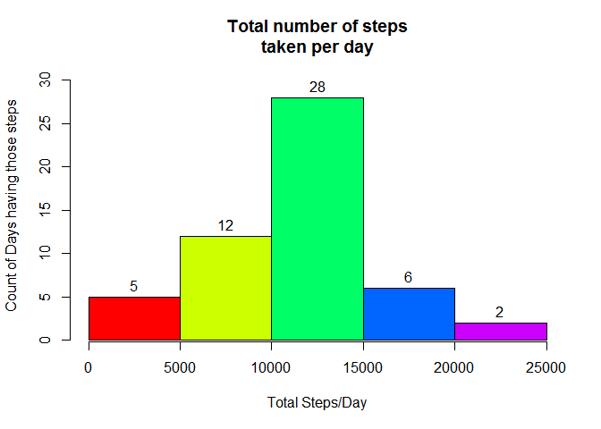
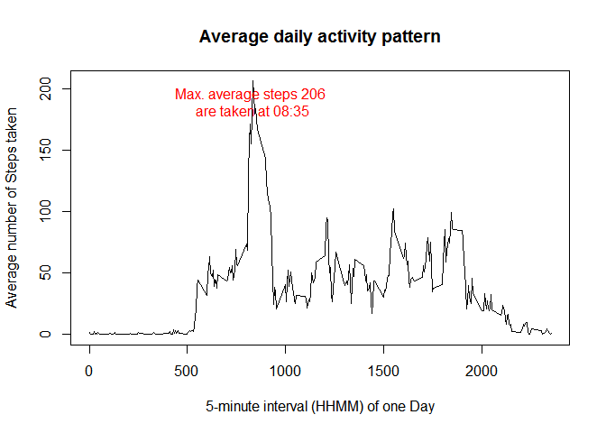
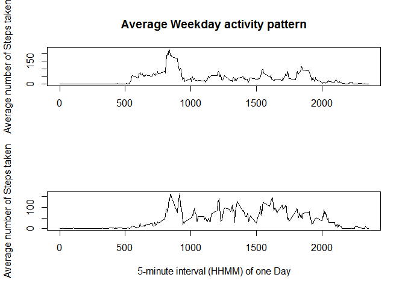

#Reproducible Research: Peer Assessment 1

```r
require(knitr)
```

```
## Loading required package: knitr
```

```
## Warning: package 'knitr' was built under R version 3.1.3
```

```r
opts_chunk$set( echo = FALSE , results="hide")
```
##About data
1. **Dataset**: Activity monitoring data [52K]
The variables included in this dataset are:

1. **steps**: Number of steps taking in a 5-minute interval (missing values are coded as NA)

2. **date**: The date on which the measurement was taken in YYYY-MM-DD format

3. **interval**: Identifier for the 5-minute interval in which measurement was taken

##Loading and preprocessing the data
####1. Attaching required Libraries

```
## 
## Attaching package: 'dplyr'
## 
## The following object is masked from 'package:stats':
## 
##     filter
## 
## The following objects are masked from 'package:base':
## 
##     intersect, setdiff, setequal, union
```
####2. Loading data into R

```r
zip_file <- "C:/Users/Administrator/datasciencecoursera/RepData_PeerAssessment1/activity.zip"
activity_data <- read.csv(unz(zip_file,"activity.csv"),sep=",", header=T)

str(activity_data)
```

'data.frame':	17568 obs. of  3 variables:
 $ steps   : int  NA NA NA NA NA NA NA NA NA NA ...
 $ date    : Factor w/ 61 levels "2012-10-01","2012-10-02",..: 1 1 1 1 1 1 1 1 1 1 ...
 $ interval: int  0 5 10 15 20 25 30 35 40 45 ...

```r
summary(activity_data)
```

     steps                date          interval     
 Min.   :  0.00   2012-10-01:  288   Min.   :   0.0  
 1st Qu.:  0.00   2012-10-02:  288   1st Qu.: 588.8  
 Median :  0.00   2012-10-03:  288   Median :1177.5  
 Mean   : 37.38   2012-10-04:  288   Mean   :1177.5  
 3rd Qu.: 12.00   2012-10-05:  288   3rd Qu.:1766.2  
 Max.   :806.00   2012-10-06:  288   Max.   :2355.0  
 NA's   :2304     (Other)   :15840                   

```r
head(activity_data)
```

  steps       date interval
1    NA 2012-10-01        0
2    NA 2012-10-01        5
3    NA 2012-10-01       10
4    NA 2012-10-01       15
5    NA 2012-10-01       20
6    NA 2012-10-01       25

####3. Preprocessing the data
  a. **date** field is maintaing as a **Factor**, it needs to be maintained with **Date** data type

  
  b. every date observation needs to be identified as **Weekday** or **Weekend**.  Hint: Weekend day names start with **"S"**

```r
activity_data$day <- weekdays(activity_data$date,abbreviate=T)
activity_data$day[substr(activity_data$day,1,1)!="S"] <- "Weekday"
activity_data$day[substr(activity_data$day,1,1)=="S"] <- "Weekend"
activity_data$day <- factor(activity_data$day)
str(activity_data)
```

'data.frame':	17568 obs. of  4 variables:
 $ steps   : int  NA NA NA NA NA NA NA NA NA NA ...
 $ date    : Date, format: "2012-10-01" "2012-10-01" ...
 $ interval: int  0 5 10 15 20 25 30 35 40 45 ...
 $ day     : Factor w/ 2 levels "Weekday","Weekend": 1 1 1 1 1 1 1 1 1 1 ...

```r
summary(activity_data)
```

     steps             date               interval           day       
 Min.   :  0.00   Min.   :2012-10-01   Min.   :   0.0   Weekday:12960  
 1st Qu.:  0.00   1st Qu.:2012-10-16   1st Qu.: 588.8   Weekend: 4608  
 Median :  0.00   Median :2012-10-31   Median :1177.5                  
 Mean   : 37.38   Mean   :2012-10-31   Mean   :1177.5                  
 3rd Qu.: 12.00   3rd Qu.:2012-11-15   3rd Qu.:1766.2                  
 Max.   :806.00   Max.   :2012-11-30   Max.   :2355.0                  
 NA's   :2304                                                          

```r
head(activity_data)
```

  steps       date interval     day
1    NA 2012-10-01        0 Weekday
2    NA 2012-10-01        5 Weekday
3    NA 2012-10-01       10 Weekday
4    NA 2012-10-01       15 Weekday
5    NA 2012-10-01       20 Weekday
6    NA 2012-10-01       25 Weekday

  c. 2304 observations contain *NA* entries. Further analyis does not require them. So, they need to be removed.


##What is mean total number of steps taken per day?
####1. Histogram of the total number of steps taken each day
 

####2. Mean and Median total number of steps taken per day

```r
v_mean   <- mean(steps_per_day$total)
v_median <- median(steps_per_day$total)
c(v_mean, v_median)
```

[1] 10766.19 10765.00

##What is the average daily activity pattern?
####1. Time series plot of the 5-minute interval and the average number of steps taken
 

####2. Which 5-minute interval, on average across all the days in the dataset, contains the maximum number of steps?

```r
print(peak_text)
```

[1] "Max. average steps 206 \nare taken at 08:35"

##Imputing missing values
Replacing the missing values ( NA entries ) of original data set  **activity_data** with mean values of same interval from the data set **activity**


####There are no missing values. All are replaced.

```r
who <- which(is.na(activity_data_imputed$steps))
print(who)
```

integer(0)

##Are there differences in activity patterns between weekdays and weekends?

 

####Conclusion:
1. in Weekdays, more activity is during morning time 

2. in Weekends, activity is almost uniform throughout the day
