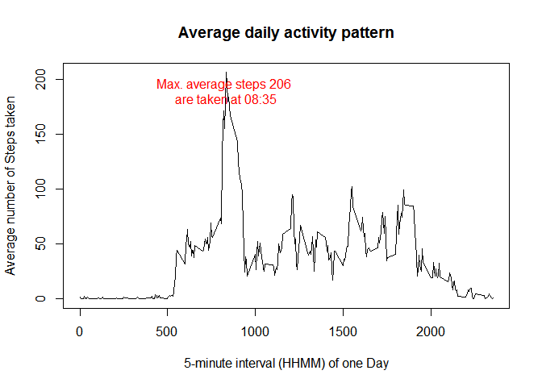
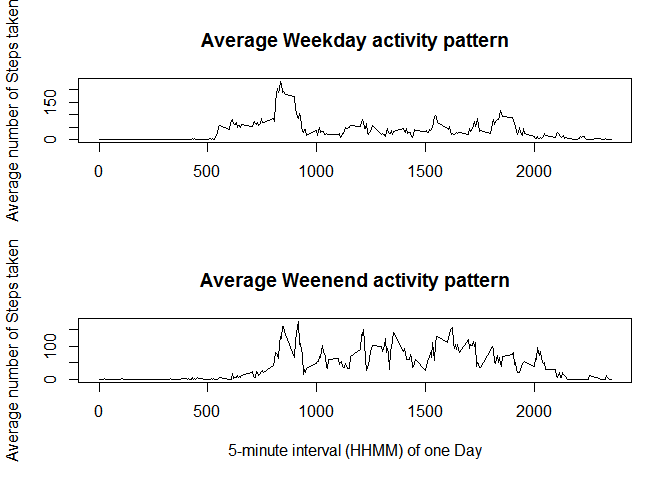

#Reproducible Research: Peer Assessment 1

```r
require(knitr)
```

```
## Loading required package: knitr
```

```
## Warning: package 'knitr' was built under R version 3.1.3
```

```r
opts_chunk$set( echo = TRUE , results="asis")
```
##About data
1. **Dataset**: Activity monitoring data [52K]
The variables included in this dataset are:

1. **steps**: Number of steps taking in a 5-minute interval (missing values are coded as NA)

2. **date**: The date on which the measurement was taken in YYYY-MM-DD format

3. **interval**: Identifier for the 5-minute interval in which measurement was taken

##Loading and preprocessing the data
####1. Attaching required Libraries

```r
library(stringr)
library(dplyr)
```

```
## 
## Attaching package: 'dplyr'
## 
## The following object is masked from 'package:stats':
## 
##     filter
## 
## The following objects are masked from 'package:base':
## 
##     intersect, setdiff, setequal, union
```
####2. Loading data into R

```r
zip_file <- "C:/Users/Administrator/datasciencecoursera/RepData_PeerAssessment1/activity.zip"
activity_data <- read.csv(unz(zip_file,"activity.csv"),sep=",", header=T)

str(activity_data)
```

'data.frame':	17568 obs. of  3 variables:
 $ steps   : int  NA NA NA NA NA NA NA NA NA NA ...
 $ date    : Factor w/ 61 levels "2012-10-01","2012-10-02",..: 1 1 1 1 1 1 1 1 1 1 ...
 $ interval: int  0 5 10 15 20 25 30 35 40 45 ...

```r
summary(activity_data)
```

     steps                date          interval     
 Min.   :  0.00   2012-10-01:  288   Min.   :   0.0  
 1st Qu.:  0.00   2012-10-02:  288   1st Qu.: 588.8  
 Median :  0.00   2012-10-03:  288   Median :1177.5  
 Mean   : 37.38   2012-10-04:  288   Mean   :1177.5  
 3rd Qu.: 12.00   2012-10-05:  288   3rd Qu.:1766.2  
 Max.   :806.00   2012-10-06:  288   Max.   :2355.0  
 NA's   :2304     (Other)   :15840                   

```r
head(activity_data)
```

  steps       date interval
1    NA 2012-10-01        0
2    NA 2012-10-01        5
3    NA 2012-10-01       10
4    NA 2012-10-01       15
5    NA 2012-10-01       20
6    NA 2012-10-01       25
####3. Preprocessing the data
  a. 2304 observations contain *NA* entries. Further analyis does not require them. So, they need to be removed.

```r
activity <- filter(activity_data, !is.na(steps))
```
  
  b. **date** field is maintaing as a **Factor**, it needs to be maintained with **Date** data type

```r
activity$date <- as.Date(activity$date)
```
  
  c. every date observation needs to be identified as **Weekday** or **Weekend**.  Hint: Weekend day names start with **"S"**

```r
activity$day <- weekdays(activity$date,abbreviate=T)
activity$day[substr(activity$day,1,1)!="S"] <- "Weekday"
activity$day[substr(activity$day,1,1)=="S"] <- "Weekend"
activity$day <- factor(activity$day)
str(activity)
```

'data.frame':	15264 obs. of  4 variables:
 $ steps   : int  0 0 0 0 0 0 0 0 0 0 ...
 $ date    : Date, format: "2012-10-02" "2012-10-02" ...
 $ interval: int  0 5 10 15 20 25 30 35 40 45 ...
 $ day     : Factor w/ 2 levels "Weekday","Weekend": 1 1 1 1 1 1 1 1 1 1 ...

```r
summary(activity)
```

     steps             date               interval           day       
 Min.   :  0.00   Min.   :2012-10-02   Min.   :   0.0   Weekday:11232  
 1st Qu.:  0.00   1st Qu.:2012-10-16   1st Qu.: 588.8   Weekend: 4032  
 Median :  0.00   Median :2012-10-29   Median :1177.5                  
 Mean   : 37.38   Mean   :2012-10-30   Mean   :1177.5                  
 3rd Qu.: 12.00   3rd Qu.:2012-11-16   3rd Qu.:1766.2                  
 Max.   :806.00   Max.   :2012-11-29   Max.   :2355.0                  

```r
head(activity)
```

  steps       date interval     day
1     0 2012-10-02        0 Weekday
2     0 2012-10-02        5 Weekday
3     0 2012-10-02       10 Weekday
4     0 2012-10-02       15 Weekday
5     0 2012-10-02       20 Weekday
6     0 2012-10-02       25 Weekday
##What is mean total number of steps taken per day?
####1. Histogram of the total number of steps taken each day

```r
steps_per_day <- summarise(group_by(activity, date), total=sum(steps))

lab_main <- "Total number of steps\ntaken per day"
lab_x    <- "Total Steps/Day"
lab_y    <- "Count of Days having those steps"

hist(steps_per_day$total,xlab=lab_x, ylab=lab_y, main=lab_main,ylim=range(1:30),labels=T, col=rainbow(5)) 
```

 

####2. Mean and Median total number of steps taken per day

```r
v_mean   <- mean(steps_per_day$total)
v_median <- median(steps_per_day$total)
c(v_mean, v_median)
```

[1] 10766.19 10765.00

##What is the average daily activity pattern?
####1. Time series plot of the 5-minute interval and the average number of steps taken

```r
steps_per_interval <- summarise(group_by(activity, interval), mean=mean(steps))

lab_main <- "Average daily activity pattern"
lab_x    <- "5-minute interval (HHMM) of one Day"
lab_y    <- "Average number of Steps taken"

plot(mean~interval,data=steps_per_interval,type="l", xlab=lab_x, ylab=lab_y, main=lab_main)

y_max_val     = max(steps_per_interval$mean)
x_max_val_pos = steps_per_interval[which.max(steps_per_interval$mean),]$interval

peak_time <- paste(str_pad(x_max_val_pos%/%100,2,pad="0"),str_pad(x_max_val_pos%%100,2,pad="0"),sep=":")
peak_text = paste("Max. average steps", round(y_max_val,0), "\nare taken at", peak_time)
text(x_max_val_pos, max(steps_per_interval$mean),peak_text,pos=1, col=2)
```

 

####2. Which 5-minute interval, on average across all the days in the dataset, contains the maximum number of steps?

```r
print(peak_text)
```

[1] "Max. average steps 206 \nare taken at 08:35"

##Imputing missing values

##Are there differences in activity patterns between weekdays and weekends?

```r
par(mfrow=c(2,1))

activity_weekday <- filter(activity, day=="Weekday")
steps_per_wkday  <- summarise(group_by(activity_weekday, interval), mean=mean(steps))

lab_main <- "Average Weekday activity pattern"
lab_x    <- "5-minute interval (HHMM) of one Day"
lab_y    <- "Average number of Steps taken"

plot(mean~interval,data=steps_per_wkday,type="l", xlab="",ylab=lab_y, main=lab_main)


activity_weekend <- filter(activity, day=="Weekend")
steps_per_wkend  <- summarise(group_by(activity_weekend, interval), mean=mean(steps))

lab_main <- "Average Weenend activity pattern"
lab_x    <- "5-minute interval (HHMM) of one Day"
lab_y    <- "Average number of Steps taken"

plot(mean~interval,data=steps_per_wkend,type="l", xlab=lab_x, ylab=lab_y, main=lab_main)
```

 

####Conclusion
1. in Weekdays, during morning hours we can find more activity

2. in Weekends, almost same amount of activity we can find
